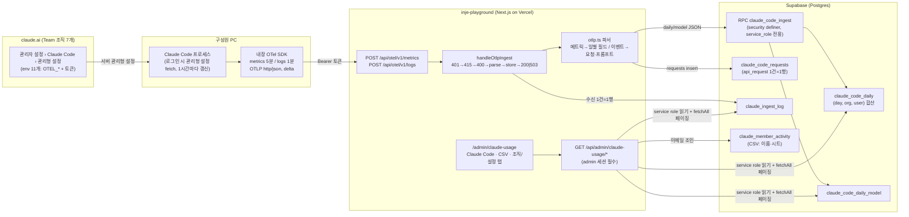
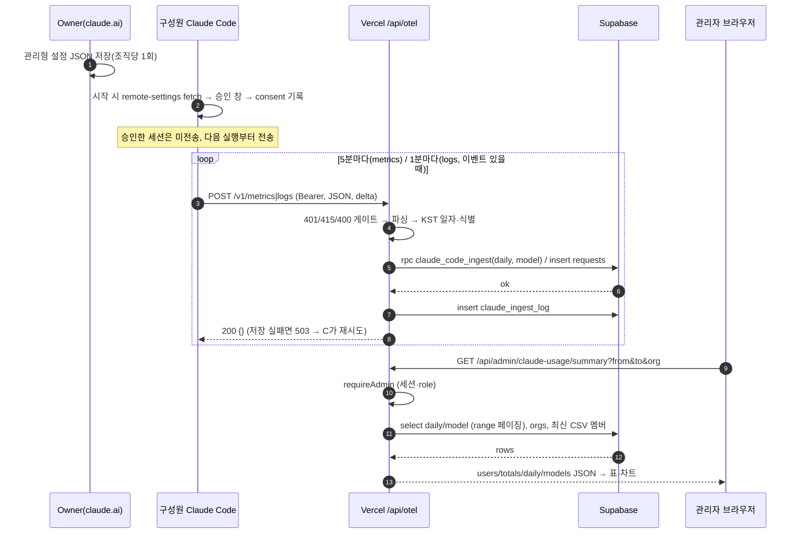

# Claude Code 사용량 수집 아키텍처

> 대상: `/admin/claude-usage` 대시보드의 **Claude Code(OTel) 경로**. 운영 절차·장애 대응은 [런북 `docs/claude-usage.md`](./claude-usage.md), 설계 배경은 [스펙](./superpowers/specs/2026-08-26-claude-usage-analytics-design.md). 작성 2026-08-27(코드 기준 커밋 `8484aa3`).

## 0. 한 장 요약



- **푸시형**이다. 우리가 Anthropic을 폴링하지 않고, 각 구성원의 Claude Code가 우리 엔드포인트로 **자기 사용량을 밀어 넣는다**. 조직 관리자가 관리형 설정을 한 번 저장하면 조직 구성원 전원의 Claude Code에 자동 적용된다.
- **저장은 델타 가산**이다. Claude Code는 5분마다 "지난 5분 증가분"만 보내고, 서버는 `(day, org, user)` 행에 더한다. 그래서 원본 이벤트를 다시 재생할 필요 없이 일별 표가 즉시 최신이다.
- **읽기는 관리자만**. 대시보드 API는 앱 로그인 세션의 `user_profiles.role = 'admin'`을 확인한 뒤 service role로 조회한다.

## 1. 왜 이 구조인가

| 검토한 경로 | 결과 |
|---|---|
| Anthropic Analytics API(사용자별 Claude Code 지표) | **Console(API 키) 조직 전용**. Team 플랜에는 없음 |
| Enterprise Analytics/Compliance API | Enterprise 플랜 전용 |
| claude.ai 분석 대시보드 | Owner만 볼 수 있고, 내보내기는 멤버 활동 CSV(30/60/90일)만 |
| 비공식 내부 API·무인 크론 스크래핑 | ToS 위반 소지 → 채택 안 함 |
| **Claude Code OpenTelemetry (관리형 설정으로 배포)** | Team 플랜 지원, 공식 기능, 사용자별·모델별·일별 상세 — **채택** |
| **멤버 활동 CSV(반자동 스킬 `/claude-usage-csv`)** | 채팅·Cowork·시트 정보의 유일한 출처 — **보조 경로로 채택**, OTel 표의 이름·시트 조인에도 사용 |

즉 Team 플랜에서 "개인별 Claude Code 사용량"을 얻는 공식 경로는 OTel 하나다. 나머지는 이 경로를 안전하게 받아 저장하고 보여주는 장치다.

## 2. 구성요소

### 2.1 송신: Claude Code + 서버 관리형 설정

- **설정 위치**: claude.ai → 관리자 설정 → Claude Code → 관리형 설정(Owner 권한). JSON은 대시보드 조직·설정 탭이 생성한다(`lib/claude-usage/managed-settings.ts` `buildManagedSettings()`).
- **내용**(env 11개):

  | 키 | 값 | 의미 |
  |---|---|---|
  | `CLAUDE_CODE_ENABLE_TELEMETRY` | `1` | 텔레메트리 켬 |
  | `OTEL_METRICS_EXPORTER` / `OTEL_LOGS_EXPORTER` | `otlp` | 메트릭·로그(이벤트) 모두 OTLP로 |
  | `OTEL_EXPORTER_OTLP_PROTOCOL` | `http/json` | protobuf 아님 — 서버가 JSON만 받음(415) |
  | `OTEL_EXPORTER_OTLP_ENDPOINT` | `https://inje-playground.vercel.app/api/otel` | 익스포터가 `/v1/metrics`, `/v1/logs`를 붙임 |
  | `OTEL_EXPORTER_OTLP_HEADERS` | `Authorization=Bearer <토큰>` | 수집 토큰(§5) |
  | `OTEL_METRIC_EXPORT_INTERVAL` | `300000` | 5분 |
  | `OTEL_LOGS_EXPORT_INTERVAL` | `60000` | 1분(이벤트가 있을 때만 전송) |
  | `OTEL_EXPORTER_OTLP_METRICS_TEMPORALITY_PREFERENCE` | `delta` | 증가분만 전송(§2.4) |
  | `OTEL_METRICS_INCLUDE_SESSION_ID` | `false` | 메트릭 카디널리티 축소 |
  | `OTEL_METRICS_INCLUDE_ACCOUNT_UUID` | `true` | 이메일 변경에도 안정적인 식별자 |

- **전달 메커니즘**: Claude Code가 claude.ai 로그인 계정의 조직에서 설정을 받아 `~/.claude/remote-settings.json`에 캐시하고 1시간마다 갱신한다. 관리형 설정은 사용자 설정보다 우선하며, 사용자가 `OTEL_EXPORTER_OTLP_LOGS_ENDPOINT` 같은 신호별 엔드포인트를 따로 두면 시작 시 제거된다(목적지 잠금).
- **승인(consent)**: `OTEL_EXPORTER_OTLP_ENDPOINT`는 "위험 설정"으로 분류돼 조직당 1회 승인 창이 뜬다. 승인 기록은 `~/.claude/remote-settings-consent.json`(조직 ID → 계정 UUID + 설정 해시). **승인한 그 세션은 익스포터가 이미 초기화된 뒤라 내보내지 않고, 다음 실행부터 내보낸다.**
- **적용 범위 밖**: Bedrock/Vertex/`ANTHROPIC_BASE_URL` 사용자는 관리형 설정 대상이 아님. API 키(Console) 인증으로 뜨는 프로세스(Agent SDK 등)는 캐시된 설정으로 전송은 하지만 `user.email`·`organization.id`가 없어 `unknown`/`id:…`로 들어온다(§6).
- **기존 키 병합**: 관리형 설정 JSON은 객체 하나라 `channelsEnabled` 등 기존 키와 `env`가 공존한다. 덮어쓰지 말고 병합한다.

### 2.2 전송 규격

- OTLP/HTTP **JSON**(`Content-Type: application/json`). 메트릭은 `resourceMetrics[].scopeMetrics[].metrics[]`, 이벤트는 `resourceLogs[].scopeLogs[].logRecords[]`.
- 식별 속성은 데이터포인트/레코드 속성에 붙고(리소스 속성에도 있을 수 있음): `user.email`, `user.account_uuid`, `user.id`, `organization.id`, `session.id`, `app.version`, `terminal.type`.
- 익스포터 재시도: **429/502/503/504만** 재시도(백오프), 500·4xx는 버림 → 서버는 저장 실패를 **503 + Retry-After: 30**으로 돌려준다.
- 이벤트 이름은 `event.name` 속성(`claude_code.api_request` 또는 접두어 없는 `api_request`) 또는 body 문자열로 온다 — 파서는 둘 다 접두어를 벗겨 비교한다(2026-08-27 실데이터로 확인·수정).

### 2.3 수신: `/api/otel/v1/{metrics,logs}` → `handleOtlpIngest`

`frontend/src/lib/claude-usage/ingest-handler.ts`. 두 라우트가 `IngestSpec`(parse/orgIds/dropped/store)만 달리 넘기는 공통 파이프라인:

```
Bearer 검사 ─✗→ 401
  │ (timingSafeEqual, 토큰 ≥ 8자 — ingest-auth.ts)
Content-Type JSON? ─✗→ 415 "use OTEL_EXPORTER_OTLP_PROTOCOL=http/json"
JSON.parse ─✗→ 400
spec.parse(body)            ← 순수 함수, DB 없음
createAdminClient() ─✗→ 500 "server not configured"   (SUPABASE_SERVICE_ROLE_KEY 없음)
spec.store(admin, parsed) ─✗→ logIngest(ok=false, error) → 503 + Retry-After: 30
logIngest(ok=true, rows, dropped, bytes) → 200 {}
```

- Node 런타임 Vercel Function. 요청당 1회 파싱·1~2회 DB 호출. 배치 크기는 보통 1~170KB.
- `claude_ingest_log`에 **수신 1건 = 1행**(signal, org_ids, rows, dropped, bytes, ok, error). 대시보드 "수집 상태"와 장애 진단의 근거.

### 2.4 파서 `otlp.ts`

**메트릭 → `claude_code_daily` 필드** (`parseMetricsPayload`):

| Claude Code 메트릭 | 속성 | 저장 필드 |
|---|---|---|
| `claude_code.session.count` | — | `sessions` |
| `claude_code.cost.usage` | `model` | `cost_usd` (+ 모델별 표) |
| `claude_code.token.usage` | `type` = input / output / cacheRead / cacheCreation, `model` | `input_tokens` / `output_tokens` / `cache_read_tokens` / `cache_creation_tokens` (+ 모델별 표) |
| `claude_code.lines_of_code.count` | `type` = added / removed | `loc_added` / `loc_removed` |
| `claude_code.code_edit_tool.decision` | `decision` = accept / reject | `edits_accepted` / `edits_rejected` |
| `claude_code.commit.count` | — | `commits` |
| `claude_code.pull_request.count` | — | `pull_requests` |
| `claude_code.active_time.total` | `type` = user / cli | `active_user_seconds` / `active_cli_seconds` |

- **temporality**: `aggregationTemporality`가 CUMULATIVE인 메트릭은 전부 버리고 `dropped`로 센다. 누적값을 더하면 폭증하기 때문. 관리형 설정이 `delta`를 강제하므로 정상 상황에선 0.
- **일자 경계**: `timeUnixNano`(BigInt 나눗셈) → KST(`+09:00`) 날짜 문자열. 하루 = 한국 자정 기준.
- **사전 집계**: 같은 `(day, org, user)`는 요청 안에서 먼저 합쳐(`DailyAcc`) RPC에 넘긴다 — Postgres `on conflict`가 한 문장에서 같은 행을 두 번 만나면 실패하기 때문.
- **식별(identity)**: `user.email`(소문자) → 없으면 `uuid:<account_uuid>` → 없으면 `id:<user.id>` → `unknown`. 조직은 `organization.id`(소문자) → `unknown`. 데이터포인트 속성이 리소스 속성보다 우선.

**이벤트 → 요청·프롬프트** (`parseLogsPayload`):

| 이벤트 | 저장 |
|---|---|
| `api_request` | `claude_code_requests` 1행(ts, 식별, model, cost, 토큰 4종, duration_ms, query_source, request_id) |
| `user_prompt` | `claude_code_daily.prompts += 1` (프롬프트 **내용은 오지 않음** — `OTEL_LOG_USER_PROMPTS` 미설정) |
| 그 외(`tool_result`, `tool_decision`, `assistant_response`, `api_error`, …) | 저장 안 함, 이름별 개수만 `ignored`로 반환. 저장 대상이 0건이면 라우트가 `console.warn("[claude-usage] logs: …")` |

### 2.5 저장: Supabase

| 테이블 | 키 | 내용 |
|---|---|---|
| `claude_orgs` | `id`(조직 UUID) | 이름·시트 수·정렬. **첫 데이터 도착 시 RPC가 자동 등록**(이름 = ID 앞 8자), 관리자가 조직·설정 탭에서 이름 지정 |
| `claude_code_daily` | `(day, org_id, user_email)` | 일별 15개 숫자 필드 + `account_uuid`, `updated_at` |
| `claude_code_daily_model` | `(day, org_id, user_email, model)` | 모델별 비용·토큰 |
| `claude_code_requests` | `id` (+`ts`, `(user_email, ts)` 인덱스) | API 요청 단위 원본. 마이그레이션 2 후 `request_id` 부분 유니크 인덱스 |
| `claude_ingest_log` | `id`, `received_at desc` 인덱스 | 수신 이력 |
| `claude_csv_imports`, `claude_member_activity` | `(org_id, period)`, `(import_id, email)` | CSV 경로(이름·시트 조인용) |

- **RPC `claude_code_ingest(p_daily jsonb, p_model jsonb)`**: `security definer`, `search_path = public`, **service_role에게만 execute**. 하는 일 ① 조직 자동 등록 ② daily upsert — 충돌 시 `col = col + excluded.col`(델타 가산), `account_uuid`는 coalesce, `updated_at = now()` ③ model upsert(같은 방식). 한 트랜잭션.
- **RLS**: 7개 테이블 모두 `for select to authenticated using (user_profiles.role = 'admin')`. **쓰기 정책 없음** → 브라우저(anon 키)로는 절대 못 쓰고 서버의 service role만 쓴다. 대신 관리자 세션 토큰으로 PostgREST를 직접 읽을 수 있어 진단에 쓸 수 있다.
- **쓰기 경로 정리**: metrics → RPC 1회. logs → `claude_code_requests` 500행 청크 insert + prompts RPC 1회. (`requests`는 현재 plain insert라 익스포터 재시도 시 중복 가능 → 마이그레이션 2 + upsert 전환 예정.)

### 2.6 조회: 대시보드 API와 UI

- 모든 `/api/admin/claude-usage/*`는 `requireAdmin()`(앱 세션 → `user_profiles.role`) 통과 후 `createAdminClient()`(service role)로 읽는다. 세션 없음 401, 비관리자 403.
- **`summary?from&to&org`** (`summary/route.ts` + `aggregate.ts summarize()`): 기본 30일(KST), 최대 366일. `claude_code_daily`·`claude_code_daily_model`을 `fetchAll()`(PostgREST 1000행 한도 우회 `.range()` 페이징)로 전부 읽고 메모리에서 집계 →
  - `users[]` 사용자별 합계 + `orgs[]`(참여 조직) + `active_days`(활동 있는 날 수) + **`name`·`seat_tier`**(조직별 **최신 CSV import**의 `claude_member_activity`와 이메일 소문자 조인; 빈 이름은 null)
  - `totals`(전체 합 + `active_users`), `daily[]`(날짜별 비용·세션·활성 사용자, 빈 날 0 채움), `models[]`(모델별 비용·토큰)
- **`health`**: `claude_ingest_log` 최근 수신 시각·24시간 수신/오류 건수·마지막 오류 + 조직별 마지막 데이터 일자; 토큰·서비스 키 설정 여부.
- **`orgs`**(이름·시트 PATCH), **`members`/`imports`**(CSV 경로).
- **UI** `components/admin/claude-usage/`: Claude Code 탭(기간 프리셋·조직 필터·사용자 표·일별 막대·모델 표·CSV 내보내기), 채팅·Cowork(CSV) 탭, 조직·설정 탭(수집 상태, 관리형 설정 JSON, 조직 이름/시트). 파생 로딩 패턴(`useEffect` fetch → 상태), 오류는 화면에 표시.

## 3. 시퀀스: 한 사용자의 하루



## 4. 보안 모델

- **수집 토큰** `CLAUDE_OTEL_INGEST_TOKEN`: `openssl rand -hex 32`로 만든 64자 공유 시크릿. Vercel 환경변수 + 관리형 설정 헤더에 동일 값. `timingSafeEqual`로 비교, 8자 미만 설정은 무효. 조직 ID가 아니며 7개 조직 공용 — 조직 구분은 페이로드의 `organization.id`. 관리형 설정에 넣는 순간 조직 구성원 전원에게 배포되므로 "외부 무단 전송 차단" 수준의 자물쇠로 이해한다. 유출 시 Vercel 값 교체 + 7개 조직 JSON 갱신.
- **service role 키**: 서버 전용(Vercel, Sensitive). 클라이언트 번들·`.env.local`에 두지 않는다.
- **RLS**: 읽기는 admin만, 쓰기는 정책 없음(service role만).
- **수집되는 것 / 안 되는 것**: 토큰 수·비용·세션·활동 시간·코드 라인 수·편집 수락/거절·커밋/PR 수·요청 메타(모델, 지연, request_id) / 응답·코드 내용·파일 경로·도구 결과 본문은 수집하지 않는다. **프롬프트 내용은 2026-08-31부터 수집**(`OTEL_LOG_USER_PROMPTS=1` → `claude_code_prompts`, 4000자 컷) — 구성원 재공지(런북 §2 안내문 v2) 선행 필수.
- **개인정보**: 식별자는 회사 이메일·계정 UUID. 대시보드 접근은 관리자에 한정.

## 5. 데이터 정확도와 알려진 한계

| 항목 | 설명 |
|---|---|
| 비용 | `claude_code.cost.usage`는 Claude Code가 **자체 단가표로 추정한 값**. Team 시트는 정액이므로 "청구액"이 아니라 "종량제였다면의 상당액"으로 읽는다. 캐시 읽기 토큰이 매우 커도 비용엔 저렴하게 반영됨 |
| 지연 | 메트릭 최대 5분 + 세션 종료 시 flush. 이벤트 1분 |
| 중복 | 델타 가산이라 익스포터가 같은 배치를 재전송(503 후)하면 daily가 두 번 더해질 수 있음(드묾). `requests`는 마이그레이션 2 후 `request_id`로 중복 방지 예정 |
| 세션 수 | 헤드리스 `claude -p`(훅·자동화)도 세션 1로 집계돼 사람의 대화 세션보다 크게 나온다. 필요하면 `requests.query_source`로 구분 |
| 식별 불가 행 | API 키 인증 프로세스(Agent SDK 등)는 `unknown` 또는 `id:<user.id>`, 조직 `unknown`("조직 미확인") — Team 시트 사용량이 아닌 Console 과금분 |
| 승인 직후 세션 | 승인한 세션은 내보내지 않음(다음 실행부터) |
| 일자 | KST 자정 기준. UTC 기준 리포트와 하루 어긋날 수 있음 |
| 대상 외 | Bedrock/Vertex/`ANTHROPIC_BASE_URL` 사용자, Claude Code 미사용 시트(→ CSV 탭의 노는 시트로 확인) |
| 조회 한도 | summary는 전 행을 메모리 집계 — 사용자 200명 × 366일 규모까지는 문제 없음. 그 이상이면 DB 집계 뷰로 전환 |

## 6. 파일 지도

| 경로 | 역할 |
|---|---|
| `frontend/src/app/api/otel/v1/{metrics,logs}/route.ts` | 수신 라우트(스펙만 지정) |
| `frontend/src/lib/claude-usage/ingest-handler.ts` | 공통 수신 파이프라인·응답 코드 |
| `frontend/src/lib/claude-usage/ingest-auth.ts` | Bearer 토큰 검증 |
| `frontend/src/lib/claude-usage/otlp.ts` | OTLP JSON 파서(메트릭·이벤트·식별·KST) |
| `frontend/src/lib/claude-usage/ingest-store.ts` | RPC 호출·requests insert·ingest_log |
| `frontend/src/lib/claude-usage/managed-settings.ts` | 관리형 설정 JSON 생성 |
| `frontend/src/lib/claude-usage/require-admin.ts` | 관리자 API 공통(세션·role·service client) |
| `frontend/src/lib/claude-usage/aggregate.ts` | `summarize()`·시트 판정·기간 프리셋 |
| `frontend/src/app/api/admin/claude-usage/{summary,health,orgs,members,imports}/route.ts` | 대시보드 API |
| `frontend/src/components/admin/claude-usage/*` | 3탭 UI |
| `frontend/src/types/claude-usage.ts` | 공용 타입·`DAILY_NUMERIC_FIELDS` |
| `docs/sql/2026-08-26-claude-usage.sql`, `-2.sql` | 스키마·RPC·RLS, 중복 방지 인덱스 |
| `frontend/src/lib/__tests__/claude-usage-*.test.ts`, `frontend/e2e/claude-usage.spec.ts` | 단위(파서·집계·CSV·인증)·E2E(게이트·관리자 화면) |
| `.claude/skills/claude-usage-csv/SKILL.md`, `frontend/scripts/claude-usage-upload.sh` | CSV 반자동 수집·업로드 |
