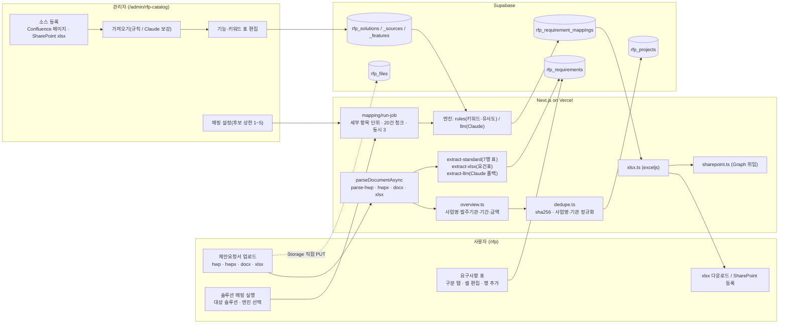

# RFP 분석 아키텍처

> 대상: `/rfp`(사용자)와 `/admin/rfp-catalog`(관리자)로 이뤄진 RFP 분석 기능 전체. 운영 절차·회귀 체크리스트는 [런북 `docs/rfp-analyzer.md`](./rfp-analyzer.md), 단계별 설계 배경은 `docs/superpowers/specs/2026-09-0*-rfp-analyzer-*.md`. 작성 2026-09-07(코드 기준 커밋 `2023825`).

## 0. 한 장 요약



## 1. 왜 이 구조인가

- **파일은 서버를 거치지 않는다.** Vercel 함수 요청 본문 상한(4.5MB)을 피하려고 브라우저가 서명 URL로 Storage에 직접 올리고, 서버는 경로만 받아 내려받아 파싱한다.
- **추출은 규칙 우선, LLM은 폴백.** 공공 제안요청서 대부분이 표준 7행 표(요구사항 고유번호·명칭·정의·세부 내용·산출정보·관련 요구사항)를 쓴다. 규칙 추출은 몇 초에 끝나고 비용이 0이며 결과가 결정적이다. 비표준 문서만 Claude로 넘긴다.
- **매핑은 후보 제시까지, 확정은 사람.** 규칙 엔진은 `candidate`(후보)만 만든다. 충족·부분충족 판정은 사람이 화면에서 바꾸거나 Claude 엔진이 낸다. 사람이 고친 행(`edited`)은 재실행이 덮어쓰지 않는다.
- **긴 작업은 `after()`.** 추출·가져오기·매핑은 요청을 202로 끊고 백그라운드에서 진행한다(maxDuration 300). 상태는 `status`·`mapping_status`로 폴링한다.
- **순수 함수 + 주입.** 파서·개요·중복·추출·매핑 규칙·xlsx 생성은 I/O가 없는 순수 함수이고, 라우트는 `pipeline.ts`·`run-job.ts`·`import-job.ts`만 호출한다. 엔진은 팩토리로 주입해 테스트에서 가짜 엔진을 넣는다.

## 2. 입력 형식과 추출

| 형식 | 파서 | 추출 경로 |
|---|---|---|
| hwp | `parse-hwp.ts` (CFB + zlib 레코드 파서 직접 구현) | 표준 7행 표 → `extract-standard` |
| hwpx | `parse-hwpx.ts` (zip + XML) | 같음 |
| docx | `parse-docx.ts` (zip + XML) | 같음 |
| xlsx | `parse-xlsx.ts` (exceljs, 병합 셀 보존) | 요건표 → `extract-xlsx` |

네 파서 모두 같은 `DocumentModel`(문단·표, 표는 병합 정보를 가진 셀 배열)을 낸다. 형식 판별은 매직넘버 + zip 내용(`Contents/section*.xml` / `word/document.xml` / `xl/workbook.xml`)이며 확장자만 믿지 않는다. xlsx만 비동기라 라우트·잡은 `parseDocumentAsync`를 쓴다.

추출 분기(`runExtraction`): 표준 7행 표가 있으면 규칙 → 없고 엑셀 요건표가 있으면 엑셀 규칙 → 둘 다 아니면 Claude(키 없으면 실패). 결과는 `extraction_method`(standard·xlsx·llm)로 남고 화면 배지에 표시된다.

- **표준 양식**: 요구사항 표마다 라벨 셀을 찾아 7필드를 읽고, 총괄표(구분·ID 부여규칙·요구사항 수)가 있으면 건수를 비교해 경고를 만든다. 총괄표 행은 `rfp_projects.category_summary`에 저장해 구분 탭 이름·검색에 쓴다. `ECR-OOO-000`처럼 세부 자리를 비운 부여규칙은 와일드카드로 다룬다.
- **엑셀 요건표**: 시트마다 헤더 후보 행을 점수로 골라(여러 열에 걸친 구역 제목 제외) 구분·No.·항목·답변·비고 열을 인식하고 **한 행 = 한 요구사항**으로 만든다. 세로 병합된 구분 열은 `cellAt`이 병합 범위를 돌려주므로 자동으로 아래 행까지 채워진다. 답변·비고는 산출정보 칸에 모아 두는데, 이 칸은 매핑 입력에 쓰이지 않아 우리 답변이 후보 매칭을 흐리지 않는다.
- **중복 판단**: sha256 동일 → 같은 프로젝트로 안내. 사업명·발주기관 정규화 키가 같으면 확인 다이얼로그(후보 제시), 사용자가 "새로 등록"을 고르면 강제 등록.

## 3. 매핑 정보 소스(카탈로그)

솔루션 기능 목록이 매핑의 유일한 근거다. 관리자가 `/admin/rfp-catalog`에서 관리한다.

1. **솔루션**: SECloudit · Devopsit · AICubeit · TabCloudit · Openstackit (활성/비활성, 정렬 순서).
2. **소스**: Confluence 페이지 URL(제목 검색 지원) 또는 SharePoint xlsx 기능명세서 링크. Confluence는 storage 포맷 XHTML을 평문으로 바꾸고(`storage-text.ts`, 이름 엔티티 복원 포함), xlsx는 시트마다 기능명·설명·키워드 열을 찾는다.
3. **가져오기**: 규칙 파서가 기본(표·제목·글머리에서 기능 후보 추출 → 이름 정규화로 기존 기능과 병합). `ANTHROPIC_API_KEY`가 있으면 "Claude로 보강"이 추가로 뜬다. 사람이 고친(✎) 기능·키워드는 어느 경로로도 덮어쓰지 않는다.
4. **키워드**: 기능 이름·설명에서 자동 생성하고 관리자가 표에서 직접 고친다(쉼표 구분, ↻로 재생성). 규칙 엔진 매칭의 핵심 입력이다.
5. **매핑 설정**: 요구사항(세부 항목)당 후보 상한 1~5(기본 5). 전역 설정 키 `rfp_mapping_max_candidates`.

기능마다 근거 URL(소스 페이지)이 붙고, 화면 카드에는 소스 문서 제목 + 기능명 + 근거 문장 + 바로가기가 표시된다.

**가져오기는 스냅샷이다.** 매핑은 DB의 카탈로그만 읽고 Confluence·SharePoint를 다시 호출하지 않는다. 원본이 바뀌면 관리자가 다시 가져와야 하며, 그 시점을 놓치지 않도록 소스 표의 "원본 대비" 열이 원본의 현재 상태만 읽어(Confluence 페이지 버전, xlsx 파일 수정 시각) 저장된 값과 비교해 최신·갱신 필요·확인 불가를 표시한다(`catalog/freshness.ts`). 자동 재가져오기는 하지 않는다 — 사람이 고친 항목과 진행 중인 제안 작업을 예고 없이 흔들지 않기 위해서다.

## 4. 매핑 단위: 세부 항목

요구사항 ID 하나가 여러 요구를 담는 일이 흔하다(세부 내용이 글머리 목록). 그래서 매핑 단위는 요구사항이 아니라 **세부 항목**이다(`mapping/detail-items.ts`).

- 1단 글머리(`○ ● □ ◇ ▶ ①` 또는 `1)` `1.` `가.`)가 2개 이상 → 그 줄들이 각각 한 단위, 하위 글머리(`- • · ※`)와 글머리 없는 줄은 위 단위에 붙는다(2depth는 1단으로 묶임).
- 1단이 없고 하위 글머리만 2개 이상 → 그 줄들을 1단 목록으로 본다(`-`만 쓰는 양식).
- 글머리가 없으면 세부 내용 전체가 한 단위(예전과 같은 요구사항 단위, `detail_key` null).
- 들여쓰기는 보지 않는다. hwp·엑셀 추출 과정에서 줄마다 공백이 잘려 신뢰할 수 없다. 단위 상한 30.

판정 조합 규칙(충족·부분충족 vs 설계·구축영역·해당없음)과 후보 상한은 **단위마다 따로** 적용된다. 같은 요구사항에서 항목 1은 충족, 항목 2는 해당없음이 공존할 수 있다.

## 5. 규칙 엔진 점수와 근거

```
hitWeight = Σ(일치 키워드 가중치)   // 기능 이름에 있는 키워드 2, 설명 키워드 1
sim       = |A∩B| / √(|A|·|B|)      // 문자 bigram 코사인 (요구 텍스트 vs 기능 이름+설명)
score     = min(1, 0.15·hitWeight + 0.7·sim)
후보 조건  = hitWeight ≥ 2 또는 sim ≥ 0.5
```

- 활성 기능의 5%를 넘게 쓰인 키워드는 변별력이 없어 매칭에서 뺀다(카탈로그 20개 이상일 때). "설정·접근·화면" 같은 범용어가 후보를 채우는 것을 막는다.
- 기능 bigram이 6개 미만(이름만 있고 설명이 없는 기능)이면 유사도를 0으로 본다.
- 정렬은 점수 내림차순 → 기능 이름 코드포인트순(로케일에 기대지 않는 결정적 정렬). 솔루션당 2개, 단위당 상한(1~5)까지.
- **근거 문장**: 기능 설명을 줄바꿈·중점·마침표로 나눠 요구 텍스트와 겹침이 가장 큰 문장을 고른다. 14자 미만 조각은 후보에서 빼고, 겹침 점수에 길이 보정(40자 기준)을 곱해 온전한 문장을 고른다. 쓸 만한 문장이 없으면 설명 전체, 설명이 없으면 기능 이름. `evidence_text`에 저장해 화면 카드와 xlsx "근거 문장" 열에 쓴다.
- Claude 엔진은 카탈로그를 시스템 프롬프트(캐싱)로 주고 세부 항목 번호(`detail`)·인용 문장(`evidence`)을 함께 받는다. 판정은 충족·부분충족·설계·구축영역·해당없음 4종이며 `candidate`는 규칙 엔진 전용이다.

## 6. 산출물

- **xlsx**: 개요(사업 정보 + 추출 경고 + 솔루션 매핑 요약) / 요구사항_목록(매핑 있으면 솔루션·기능·판정·설명·근거 URL 열 추가) / 구분별 상세 시트 / 마지막에 솔루션_매핑 시트(세부 항목·근거 문장 포함). 상세 시트 번호를 바꾸지 않으려고 매핑 시트를 항상 맨 뒤에 둔다.
- **SharePoint 등록**: 사용자 위임 OAuth로 지정 폴더에 같은 xlsx를 올린다(같은 날 재업로드는 덮어쓰기). 업로드 이력과 Teams 채널 알림이 남는다. refresh 토큰은 AES-256-GCM으로 암호화해 보관하고 어떤 로그·응답에도 쓰지 않는다.

## 7. 데이터 모델

| 테이블 | 핵심 컬럼 |
|---|---|
| `rfp_projects` | 사업 개요 5필드, `status`(extracting·ready·failed), `extraction_method`, `warnings`, `category_summary`(총괄표), `mapping_status`·`mapping_error`·`mapping_warnings`·`mapping_at`, `sharepoint_folder` |
| `rfp_files` | `storage_path`, `original_filename`, `format`(hwp·hwpx·docx·xlsx), `sha256`(유니크) |
| `rfp_requirements` | `category_code`·`category_name`, `req_id`, 7필드, `sort_order`, `source` |
| `rfp_solutions` / `rfp_solution_sources` / `rfp_solution_features` | 솔루션·소스(kind confluence·xlsx, import_status)·기능(`name_norm` 유니크, `keywords`, `edited`) |
| `rfp_requirement_mappings` | `requirement_id`, `detail_key`·`detail_text`(세부 항목), `solution_code`·`feature_id`, `verdict`, `rationale`, `evidence_text`, `evidence_url`, `engine`(rules·llm·manual), `score`, `edited`, `sort_order` |
| `rfp_sharepoint_uploads` / `ms_connections` | 업로드 이력 / 사용자별 Microsoft 연결(암호화 토큰) |

RLS는 켜져 있고 정책은 관리자 읽기만 둔다. 쓰기는 서버(service role)만 한다.

## 8. 권한과 보안

- `/rfp`는 user 이상(`lib/rfp/require-user.ts`), `/admin/rfp-catalog`와 카탈로그 API는 admin.
- 프로젝트는 조직 공용이다. 등록자만 볼 수 있게 하지 않는다(제안 작업이 팀 단위라서). 삭제는 등록자 또는 admin.
- Storage 버킷 `rfp`는 비공개이며 다운로드는 서버가 만든 서명 URL로만 한다.
- Microsoft·Anthropic·Atlassian 자격 증명은 모두 서버 환경변수이고, 클라이언트로 내려가는 응답에는 존재 여부(`llmAvailable`)만 담는다.

## 9. 알려진 한계

- 규칙 엔진 후보는 짧은 항목에서 범용어에 끌린다. 확정 판정은 사람 검토 또는 Claude 엔진이 필요하다.
- 엑셀 요건표는 표지가 없어 사업명·발주기관을 문서에서 찾지 못한다(파일명 폴백 후 개요에서 수정). 숨긴 시트는 읽지 않는다.
- 원본 견적요청 엑셀의 답변·비고 칸을 채워 되돌려주는 기능은 없다. 산출물은 우리 표준 xlsx다.
- SharePoint 공유 링크(`:x:/s/…`)는 Graph에서 403이 날 수 있어 직접 경로 URL로 등록해야 한다. 사이트 정책에 따라 접근이 막히는 곳이 있다.
- hwp 파서는 배포용·암호화 문서를 지원하지 않는다(415로 안내).

## 10. 파일 지도

```
frontend/src/
  app/rfp/page.tsx                     목록·업로드·설명
  app/rfp/[id]/page.tsx                상세(개요·요구사항 표·매핑·SharePoint)
  app/admin/rfp-catalog/page.tsx       카탈로그 관리
  app/api/rfp/…                        업로드 티켓·프로젝트·요구사항·매핑·카탈로그·SharePoint
  app/api/admin/rfp-catalog/…          솔루션·소스·가져오기·기능
  components/rfp/                      업로드·개요·요구사항 표·매핑 편집기·SharePoint 섹션
  components/admin/rfp-catalog/        솔루션·소스·기능 표·매핑 설정
  lib/rfp/
    parse*.ts document-model.ts        문서 파서 4종 + 공통 모델
    overview.ts dedupe.ts              개요 추출·중복 판단
    extract-standard.ts extract-xlsx.ts extract-llm.ts
    category-summary.ts requirements.ts
    pipeline.ts                        registerProject · runExtraction
    catalog/                           소스 종류·Confluence·xlsx·규칙 추출·키워드·병합·runImport
    mapping/                           detail-items · tokenize · rules · engine · prompt · llm · validate · summary · settings · run-job
    xlsx.ts sharepoint.ts url.ts
  lib/ms/                              위임 OAuth·토큰 암호화·Graph 드라이브
docs/
  rfp-analyzer.md                      런북(설치·운영·회귀 체크리스트 1~48)
  rfp-analyzer-architecture.md         이 문서
  sql/2026-09-0*-rfp-*.sql             스키마 변경 이력
```
